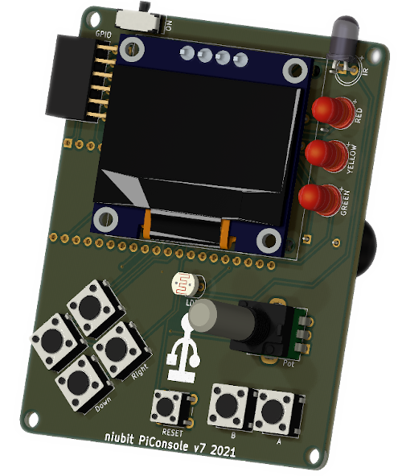

# PiConsole - Raspberry Pi Pico Retro Console



This repository has submodules. To clone add the `--recursive` option to the git clone command:

```
git clone --recursive https://github.com/niubit/piconsole.git
```

You can see a brief description (in spanish) in [this site](https://niubitbox.niubit.es/docs/niubitbox005/). A full description in english is available in [Instructables](https://www.instructables.com/PiConsole-Raspberry-Pi-Pico-Retro-Console/).
